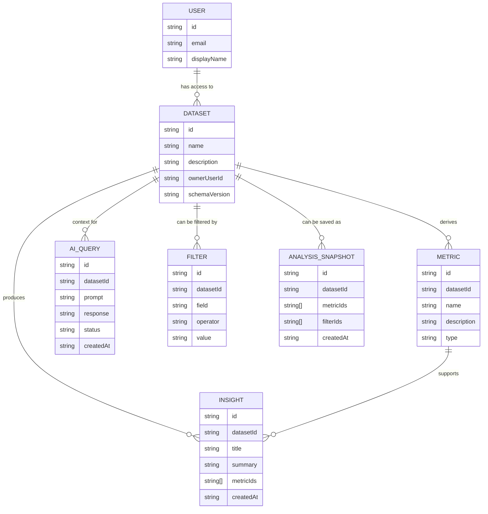

# InsightHub — Domain Model (v1)

This document describes the main domain entities and their relationships.
It is a lightweight, evolving reference to keep terminology and invariants consistent.

---

## 1) Entity Relationship Diagram (ERD)

## 2) Entity Definitions

### User

Represents an authenticated person interacting with InsightHub.

### Dataset

A dataset is the primary context for exploration, analysis and AI queries.
It can evolve over time via `schemaVersion`.

### Metric

A metric is a computed/derived signal from a dataset (e.g., revenue, active users).

### Insight

An insight is a derived narrative or observation grounded in dataset context and supported by one or more metrics.

### AIQuery

Represents a user question and AI-assisted response tied to a dataset context.
AI is optional; the product should remain usable without it.

### Filter

A filter scopes analysis within a dataset context (generic in v1: field/operator/value).

### AnalysisSnapshot (v1)

A snapshot represents a saved analysis view (selected metrics + filters) for later review or sharing.
In v1, it is part of the domain model even if it is not implemented as a user-facing feature yet.

---

## 3) Invariants & Rules (v1)

### Dataset

- A Dataset is the primary context for analysis and AI.
- `schemaVersion` exists to support future dataset structure evolution.

### Metric

- A Metric is always derived from exactly one Dataset.
- A Metric cannot exist without a valid `datasetId`.

### Insight

- An Insight must reference the dataset it belongs to (`datasetId`).
- An Insight should reference one or more metrics (`metricIds`) that support it.

### AIQuery

- An AIQuery must always include dataset context (`datasetId`).
- AI capability is optional (degraded mode supported).

### Filter

- Filters always apply within a dataset context (`datasetId`).
- Filters are generic in v1 and should not embed dataset-specific business rules.

### AnalysisSnapshot

- A snapshot must reference a dataset (`datasetId`).
- A snapshot may reference selected metrics and filters (`metricIds`, `filterIds`).
- A snapshot should be persistable and shareable as a stable representation of an analysis view.

A snapshot may reference selected metrics and filters (metricIds, filterIds).

A snapshot should be persistable and shareable as a stable representation of an analysis view.